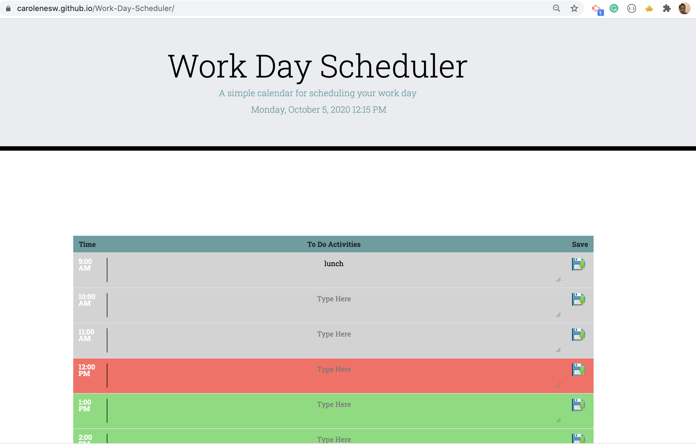

# Work-Day-Scheduler

## User Story 

Create a daily planner application that allows user to save events/to do items for each hour. The planner should also features time blocks based on available, past and current times. 

## Technology

- JQuery
- Moment.js
- Local Storage 
- HTML/CSS
- Bootstrap
- Google Fonts  

## Usability

- Planner should display the current date and time at the top of the page. 
- Time block should be from 9am to 5pm (standard time). 
- Each time block should be color-coded based on time of day.   
    - Red, current/present time
    - Green, available/future time
    - Gray, past time
- User should be able to enter task in text area.
- User should be able to save the items in local storage.
- When the page is refresh, the event/item should still be available.

## link

https://carolenesw.github.io/Work-Day-Scheduler/

## Image

    
